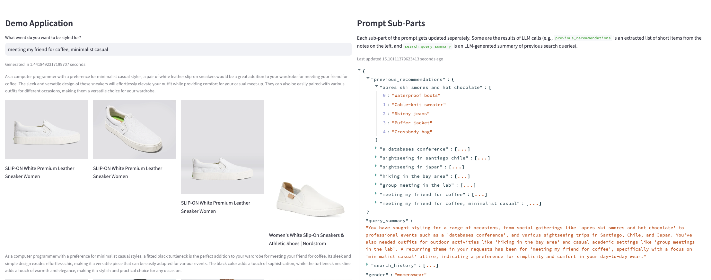

# SIGMOD 2024 Demo Submission for Motion

This repository contains the artifacts for the SIGMOD 2024 demo submission for Motion. The demo is an interactive e-commerce LLM pipeline that showcases the capabilities of [Motion](https://github.com/dm4ml/motion). Motion is a Python-native framework to define, maintain, and execute LLM pipelines with reactive prompts.

## How to run the demo

First, you will need to install the dependencies with the following command:

```bash
pip install -r requirements.txt
```

For Motion, you will need to make sure Redis is running (I use Docker for this).

Next, you will need to define API keys in a `.env` file in the root of the repository. The `.env` file should look like this:

```
AZURE_OPENAI_ENDPOINT=...
AZURE_OPENAI_KEY=...
AZURE_API_VERSION=...
SERPER_API_KEY=...
```

Then, you can run the demo with the following command:

```bash
streamlit run dashboard.py
```

Here is a screenshot of the Streamlit after several queries:


